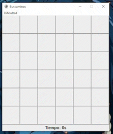

# BuscaLIMA (minesweeper game)
In this repository we will recreate the minesweeper game using the Python programming language. 

To develop this game, we have used different Python packages.Here are the most important ones: 

|Package |Description            |Usage                  |
|--------|--------------------------------------------------------------------------------------------------|---------------------------------------------------|
|tkinter |Tkinter is the package that is considered a standard for the graphical user interface for Python     |In this project, Tkinter fulfills the task of creating and managing the user interface|      

# Functioning
The player will have three options for the level they choose( easy, intermediate and difficult). Once the difficulty has been chosen, the interface will generate a grid where they can play.
 git clone https://github.com/emafriki/BuscaLIMA/img

# Use 
The following GIF shows an example of how the game works, you can also download the EXE for Windows (downloading the 'dist' folder)

# In case of receiving any type of error:
* Check that you've typed the commands correctly. 

* Verify that you have downloaded the required images

* Check that you have the Tkinter packages in your Python installation.

# Collaborators

* Cruz Aviles Maritza Nazareth

* Chavez Perales Mariana 

* Meneses Bote Mauritania

* Patiño Chavez Alma Rocio 
