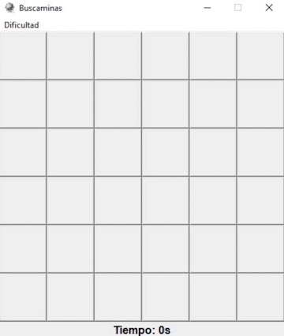

# BuscaLIMA (minesweeper game)
In this repository we will recreate the minesweeper game using the Python programming language. 

Minesweeper is a game whose objective is to clear all the squares in a minefield without detonating any.

To develop this game, we will take the help of the following libraries:

|Package |Description            |Usage                  |
|--------|--------------------------------------------------------------------------------------------------|---------------------------------------------------|
|tkinter |Tkinter is the package that is considered a standard for the graphical user interface for Python     |In this project, Tkinter fulfills the task of creating and managing the user interface|      
|--------|--------------------------------------------------------------------------------------------------|---------------------------------------------------|
|ramdom|implements pseudorandom number generators for various distributions.|  |

# Functioning
The player will have three options for the level they choose( easy, intermediate and difficult). Once the difficulty has been chosen, the interface will generate a grid where they can play.
 

# Game tutorial
This game is inspired by the Windows classic, with right click you uncover boxes and with left click you set the flags (flags are used to indicate where there is possibly a mine), it has a timer, as well as three levels of difficulty. 

You win if you clear all the squares in the minefield without detonating any. You can also use flags to rule out places where there may be mines. If you make a mistake and click on a space with a mine, you will have to start over or finish the game.

To download the necessary files and be able to play it, you can run the following

>git clone code https://github.com/emafriki/BuscaLIMA

# Use 
The following GIF shows an example of how the game works, you can also download the EXE for Windows (downloading the 'dist' folder)

# In case of receiving any type of error:
* Check that you've typed the commands correctly. 

* Check that the git clone code https://github.com/emafriki/BuscaLIMA has been copied correctly

  
* Check that you have the Tkinter packages in your Python installation.

# Collaborators

* Cruz Aviles Maritza Nazareth

* Chavez Perales Mariana 

* Meneses Bote Mauritania

* Patiño Chavez Alma Rocio 
